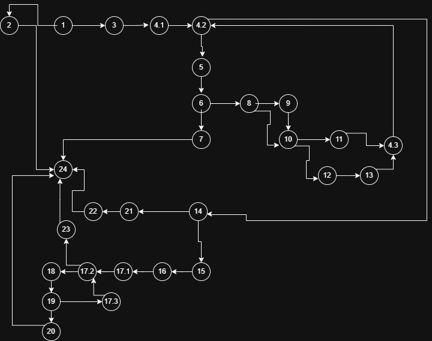

Виктор Никифоровски 236018

2. Control Flow Graph

3. Цикломатската комплексност

Цикломатската комплексност може да се пресмета со броење на регионите тоа се 9.

Исто така може да се определи со броење на сите јазли и ребра со формула: e - n + 2
Во графот има 28 јазли и 35 ребра значи 35 - 28 + 2 = 9

Или исто така може да се одреди и со вкупен број на условни гранки + 1
9

4. Every Statement

Ќе ни требаат минимално 5 тест случаи бидејќи има 5 излеза од кодот. 
Првиот ќе биде тест случај во кој allItems = null со ова ќе се фрли RuntimeException и ќе излеземе во 24. (allItems=null, cardnumber=anything)
Вториот ќе биде тест случај во кој во allItems има Item со name = null, па во јазел 7 ќе се фрли RuntimeException и ќе излеземе во 24, но предтоа има нормални имиња на Items па затоа ќе се поминат и сите јазли во for,бидејќи со пример првиот ќе се поминат јазлите без 13, а со вториот бидејќи discount = 0 ќе се помине и 13, и на крај со name = null ќе се фрли RuntimeException. (allItems = [Item(name = "name", quantity = 10, price = 301, discount = 10), Item(name = "name", quantity = 10, price = 301, discount = 0), Item(null, ...)], cardnumber=anything)
Третиот ќе биде тест случај каде allItems ќе помине добро, но во јазел 14 каде се проверува cardNumber = null, па ќе излезе со RuntimeException во јазел 22 и ќе излеземе во 24. (allItems = [Item(name = "name", quantity = 10, price = 301, discount = 10), Item(name = "name", quantity = 10, price = 301, discount = 0)], cardnumber=null)
Четвртиот ќе биде тест случај каде allItems ќе помине добро, и јазел 14 каде се проверува cardNumber = null ќе помине добро но во јазел 19 каде се проверува дали има недозволени карактери ќе премине во 20 и ќе се фрли RuntimeException и ќе излеземе во 24. Должината на cardnumber ќе биде 16 и ќе имаме недозволен карактер d. (allItems = [Item(name = "name", quantity = 10, price = 301, discount = 10), Item(name = "name", quantity = 10, price = 301, discount = 0)], cardnumber="123044423423213d")
И последниот тест случај ќе биде со нормален добар тек на кодот и на крај ќе се врати sum со јазелот 23 и ќе излеземе во 24. (allItems = [Item(name = "name", quantity = 10, price = 301, discount = 10), Item(name = "name", quantity = 10, price = 301, discount = 0)], cardnumber="1230444234232135")

5. Multiple Condition

Кај multiple condition може да имаме и lazy evaluation каде не се битни некои случаеви.

if (item.getPrice() > 300 || item.getDiscount() > 0 || item.getQuantity() > 10)

За овој услов има вкупно 2^3 = 8 комбинации на T/F
Но, нас ни се важни само TXX, ако првиот е T другите не се битни. (Item(name = "name", quantity = anything, price = 301, discount = anything));
FTX, ако првиот е F вториот е T и со тоа последниот не е битно дека ќе помине условот. (Item(name = "name", quantity = anything, price = 299, discount = 1))
FFT, ако првиот е F вториот е F и третиот е T. (Item(name = "name", quantity = 11, price = 299, discount = 0))
и имаме FFF (Item(name = "name", quantity = 9, price = 299, discount = 0))

